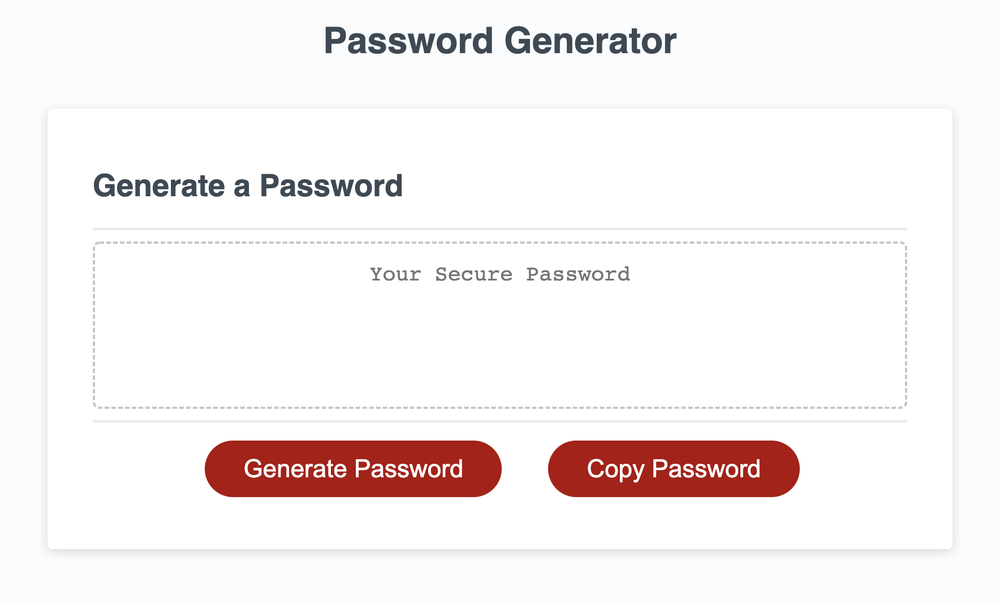

# Password Generator

The goal for this project is to build a password generator that randomly generates a strong password that meets specific criteria.

## Acceptance Criteria

GIVEN I need a new, secure password
WHEN I click the button to generate a password
THEN I am presented with a series of prompts for password criteria
WHEN prompted for password criteria
THEN I select which criteria to include in the password
WHEN prompted for the length of the password
THEN I choose a length of at least 8 characters and no more than 128 characters
WHEN asked for character types to include in the password
THEN I confirm whether or not to include lowercase, uppercase, numeric, and/or special characters
WHEN I answer each prompt
THEN my input should be validated and at least one character type should be selected
WHEN all prompts are answered
THEN a password is generated that matches the selected criteria
WHEN the password is generated
THEN the password is either displayed in an alert or written to the page

## How to run this program

1. Open the 'index.html' file in a browser
OR
2. View a live preview of my project below

## Live Preview

View a [live preview](https://leandrib.github.io/password-gen/) of my project.

## Screenshot

## Attributions

* [Starter Code](https://github.com/coding-boot-camp/friendly-parakeet)
* [Number.isInteger() method](https://www.w3schools.com/jsref/jsref_isinteger.asp)
* [String to an array](https://stackabuse.com/how-to-convert-a-string-to-an-array-in-javascript/)
* [How to use window.prompt](https://developer.mozilla.org/en-US/docs/Web/API/Window/prompt)
* [While Loop](https://www.w3schools.com/js/js_loop_while.asp)
* [Copy Button](https://www.w3schools.com/howto/howto_js_copy_clipboard.asp)